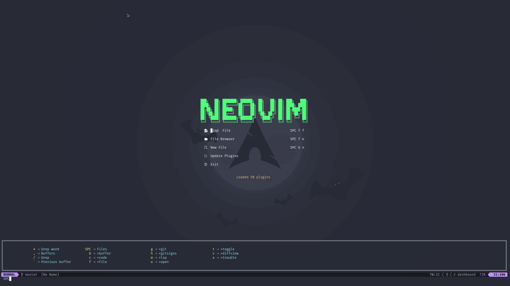
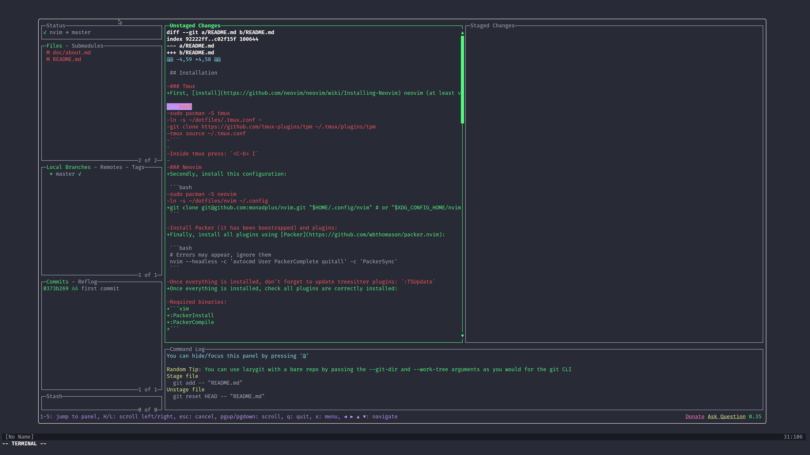
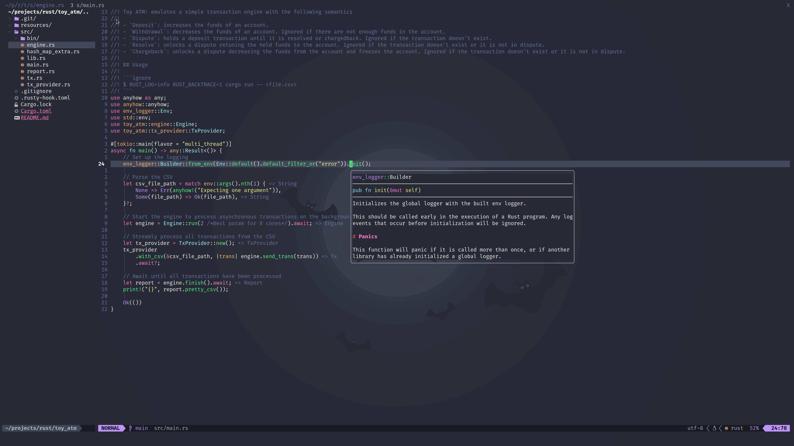

# monadplus/nvim





## Installation

First, [install](https://github.com/neovim/neovim/wiki/Installing-Neovim) neovim (at least version 8.0).

Secondly, install this configuration:

```bash
git clone git@github.com:monadplus/nvim.git "$HOME/.config/nvim" # or "$XDG_CONFIG_HOME/nvim"
```

Finally, install all plugins using [Packer](https://github.com/wbthomason/packer.nvim):

```bash
# Errors may appear, ignore them
nvim --headless -c 'autocmd User PackerComplete quitall' -c 'PackerSync'
```

Once everything is installed, check all plugins are correctly installed:

```vim
:PackerInstall
:PackerCompile
```

And update treesitter parsers (see [treesitter.lua](/lua/monadplus/plugins/treesitter.lua)):

```bash
# Stored at '/home/arnau/.local/share/nvim/site/pack/packer/start/nvim-treesitter/parser'
:TSUpdate
```

### Dependencies

- [fd](https://github.com/sharkdp/fd)
- [ripgrep](https://github.com/BurntSushi/ripgrep)
- [lazygit](https://github.com/jesseduffield/lazygit)

### Optional dependencies

- [node](https://nodejs.org/en/) and [yarn](https://yarnpkg.com/) for [markdown-preview](https://github.com/iamcco/markdown-preview.nvim) 

### LSP Servers

LSP servers can be installed from your distribution's package manager.
Alternatively, you can configure the plugin [mason.nvim](https://github.com/williamboman/mason.nvim) (**which is not configured**) to automatically install them.

This configuration expects the following LSP servers:
- bash-language-server (bash)
- ccls (pacman) + bear (c/c++)
- hls (haskell)
- pyright (python)
- marksman (markdown)
- lua-language-server (lua)
- nil (nix)
- rust-analyzer (rust)
- yaml-language-server (yaml)

Feel free to add/remove servers from [lsp.lua](/lua/monadplus/plugins/lsp.lua). See [server configurations](https://github.com/neovim/nvim-lspconfig/blob/master/doc/server_configurations.md) for more information of available servers.

## Issues

Feel free to open an [issue](https://github.com/monadplus/nvim/issues) to fix or improve this configuration.
