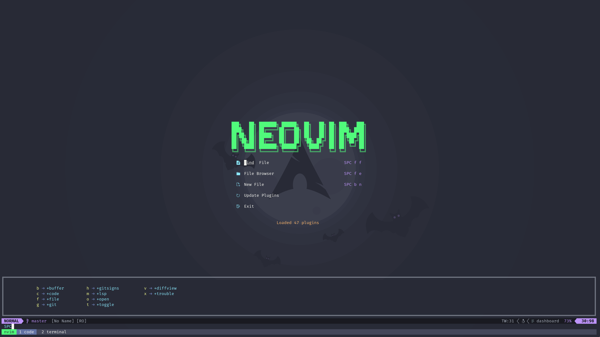

# Neovim + lua



## Installation

### Tmux

```bash
sudo pacman -S tmux
ln -s ~/dotfiles/.tmux.conf ~
git clone https://github.com/tmux-plugins/tpm ~/.tmux/plugins/tpm
tmux source ~/.tmux.conf
```

Inside tmux press: `<C-b> I`

### Neovim

```bash
sudo pacman -S neovim
ln -s ~/dotfiles/nvim ~/.config
```

Install Packer (it has been boostrapped) and plugins:

```bash
# Errors may appear, ignore them
nvim --headless -c 'autocmd User PackerComplete quitall' -c 'PackerSync'
```

Once everything is installed, don't forget to update treesitter plugins: `:TSUpdate`

Required binaries:

- `node` and `yarn` (markdown-preview)

```bash
sudo pacman -S ueberzug # Preview
paru -S poppler # pdftoppm (pdfs)
```

LSPs:

- bash-language-server (pacman)
- ccls (pacman) + bear (pacman)
- hls (nixpkgs)
- pyright (nixpkgs)
- marksman (pacman)
- lua-language-server (pacman)
- rnix (nixpkgs)
- rust-analyzer (nixpkgs or rustup)
- yaml-language-server (pacman)

```bash
sudo pacman -S lua-language-server bash-language-server yaml-language-server ccls bear
paru -S marksman-bin # markdown server
```

## Tips & Tricks

- `nvim --startuptime startup.txt`
